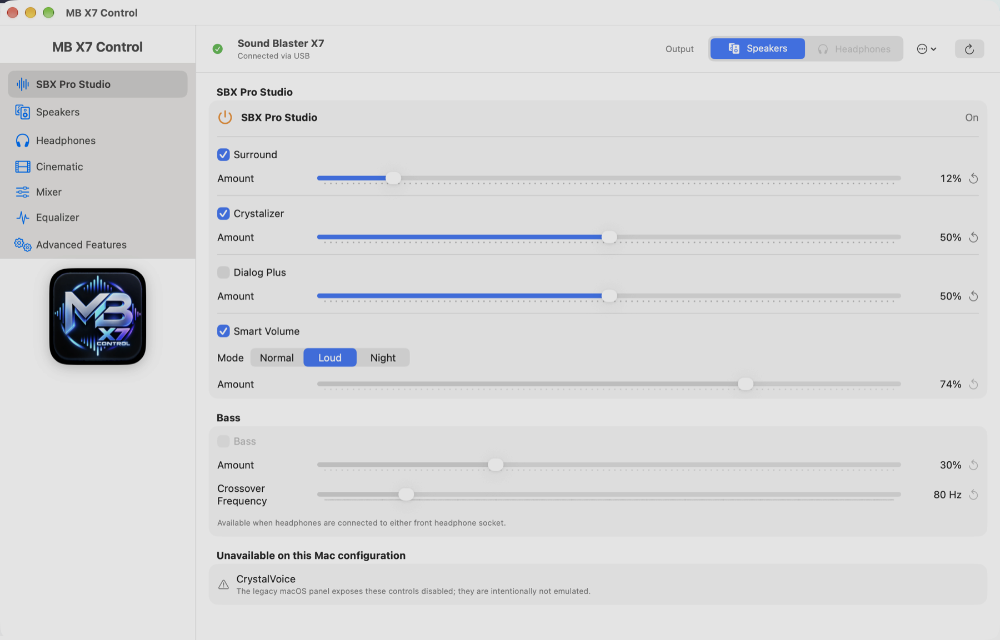
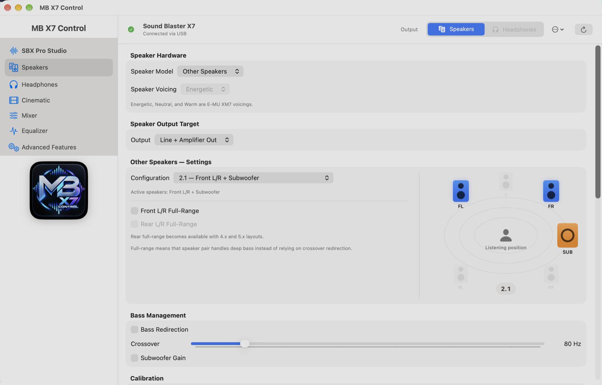
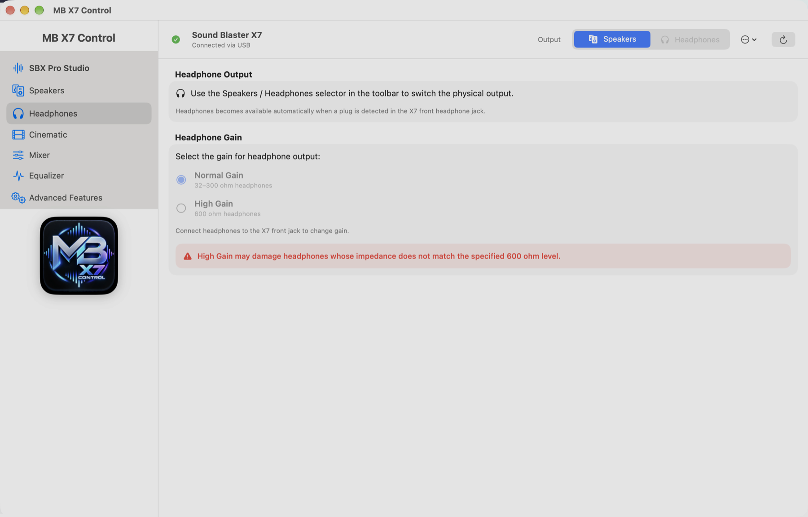
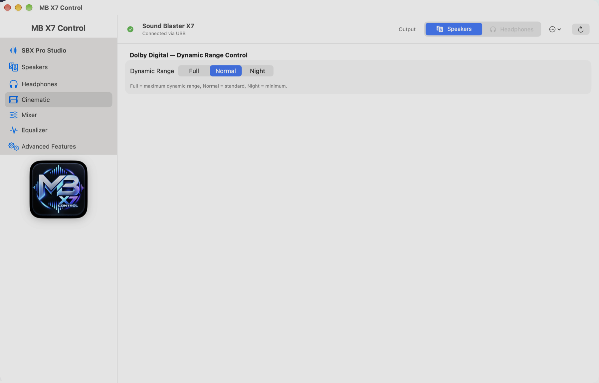
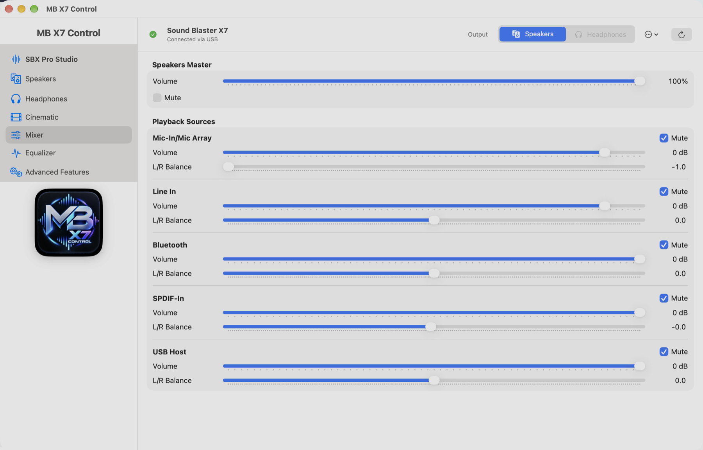
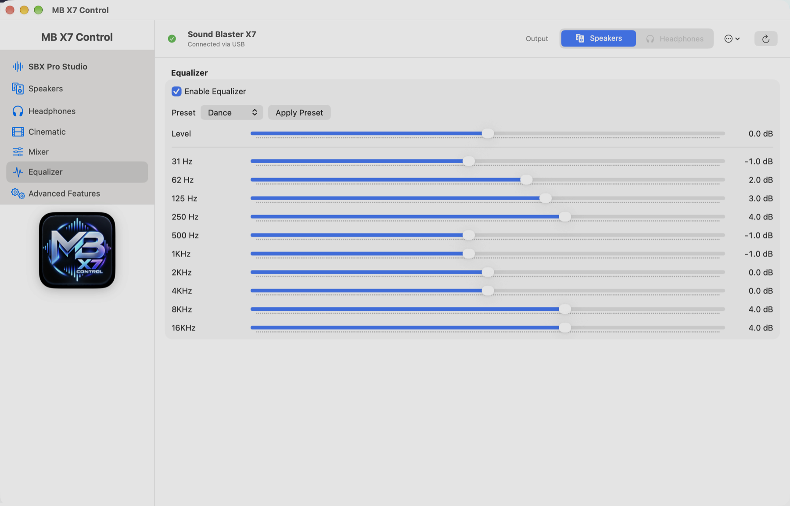
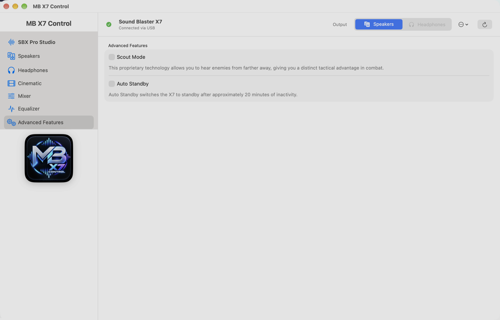

# MB X7 Control for macOS

Unofficial native Apple-silicon controller for the Creative Sound Blaster X7.

Project owner and maintainer: [alcatron](https://github.com/alcatron)

Repository: [alcatron/mb-x7-control](https://github.com/alcatron/mb-x7-control)

Independently developed for hardware interoperability. Not affiliated with, endorsed by, or supported by Creative Technology Ltd.

MB X7 Control is free and source-available. Personal and internal business use,
inspection, modification, contribution, and free redistribution are permitted
under the project licence. Selling the software or offering paid redistribution
is not permitted.

## Screenshots

View every main section

### Speakers

### Headphones

### Cinematic

### Mixer

### Equalizer

### Advanced Features

## v1.0 feature set

- USB connection detection (Creative VID `041e`, X7 PID `323a`)
- Live Speakers / Headphones output switching
- SBX master, Surround, Crystalizer, Dialog Plus and Smart Volume
- Headphone-path SBX Bass amount and crossover controls
- Smart Volume Normal / Loud / Night modes
- Speaker model selection for Other Speakers and E-MU XM7
- E-MU XM7 Energetic / Neutral / Warm voicing
- 2.0 through 5.1 speaker layouts and Line / Amplifier / Both output targets
- Front and rear full-range flags, six-channel distance, level, and polarity calibration
- Bass Redirection, 10–500 Hz crossover and Subwoofer Gain
- High Power Amplification and headphone surround over line/optical output
- Headphone Direct Mode and SPDIF-In Direct Mode
- Normal and guarded 600-ohm High Gain headphone output modes
- Dolby Digital dynamic range Full / Normal / Night
- 10-band EQ, overall EQ level and all captured factory presets
- Scout Mode
- Auto Standby
- X7 Speakers master volume and mute through CoreAudio
- Five-source Playback Mixer volume, mute, and L/R balance through USB Audio feature units
- Utility menu with Restore Default, persistent macOS playback/recording device selection, and About
- macOS menu-bar access with an optional Open at Login setting

### Deliberately not faked

The legacy macOS panel exposes CrystalVoice disabled on this X7 configuration, so MB X7 Control does not invent support for it. SBX Bass is available only on the detected headphone path, matching the original X7 panel.

Master volume and Playback Mixer values are read directly from the connected X7. Other controls open with the last choices saved for that X7, or Creative-compatible starting values when no saved choice exists. Saved macOS playback/recording selections and saved Mixer mute choices are intentionally restored at launch or reconnect; other hardware settings are sent only when the user changes their controls. The explicit Creative Default action applies only the supported SBX, EQ and Dolby profile values and does not alter speaker layout, routing, amplification, calibration, Direct Mode, Scout Mode or standby.

Playback Mixer uses the X7's standard USB Audio class requests directly through
public IOKit. The Creative application and its private frameworks are neither
linked nor required at runtime. The independently documented transport is
described in [`PROTOCOL.md`](PROTOCOL.md).

## To use MB X7 Control

- Apple silicon Mac (arm64 only)
- macOS 14 or later
- Creative Sound Blaster X7 connected by USB

## To build from source

- Xcode 16 or later
- No paid Apple Developer membership required

Open `X7Control.xcodeproj`, choose the **X7Control** scheme and **My Mac**, then
press **Command-R**. The target is configured for `arm64` only. See the complete
[`GETTING_STARTED.md`](GETTING_STARTED.md) guide for downloading, building,
installing and using the app.

## Safety

Headphone High Gain is available only after an explicit safety confirmation and defaults to Normal Gain. High Gain is intended for 600-ohm headphones; inappropriate use may damage headphones.

## Protocol

See [`PROTOCOL.md`](PROTOCOL.md). The public protocol document contains observed interface behavior and independently written implementation details; no Creative binaries or frameworks are included.

## License

MIT License with the Commons Clause License Condition v1.0. This is a
source-available licence, not an OSI open-source licence. See [`LICENSE`](LICENSE)
and the plain-language [`LICENSE-FAQ.md`](LICENSE-FAQ.md).

The MB X7 Control name, logo, icon and original artwork are covered separately
by [`TRADEMARKS.md`](TRADEMARKS.md).

See [`GETTING_STARTED.md`](GETTING_STARTED.md), [`PRIVACY.md`](PRIVACY.md),
[`SUPPORT.md`](SUPPORT.md), and [`CONTRIBUTING.md`](CONTRIBUTING.md) for usage,
privacy, support, and contribution information.

## Support the project

MB X7 Control is completely free. Optional donations may help the project
maintainer cover testing hardware and continued development. Donations do not
unlock features, updates or support.

## Distribution

The initial v1.0 release is source-only through GitHub. Users build MB X7
Control locally with Xcode; Apple Developer enrollment, Developer ID signing,
and notarization are not required for this release.

The project retains optional tooling for a possible future Developer ID signed
and Apple-notarized arm64 DMG. Mac App Store support is not a v1.0 requirement.
See [`RELEASING.md`](RELEASING.md) for the source-release checklist and the
separate future binary-release process.
